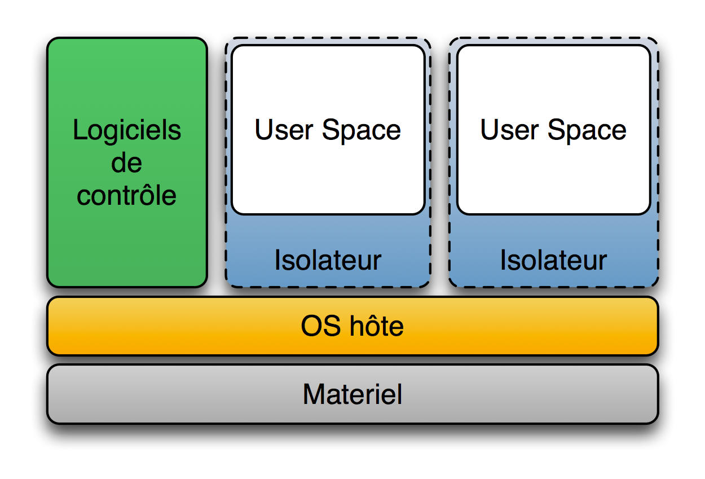
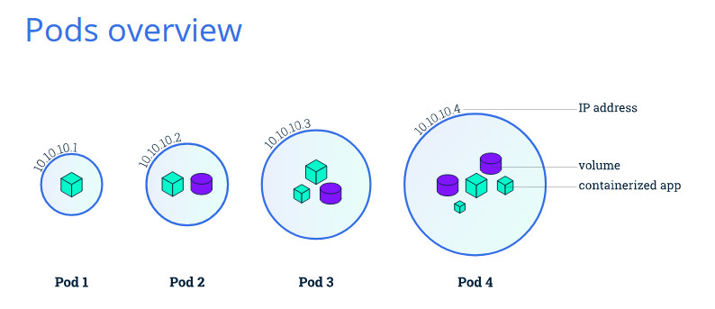
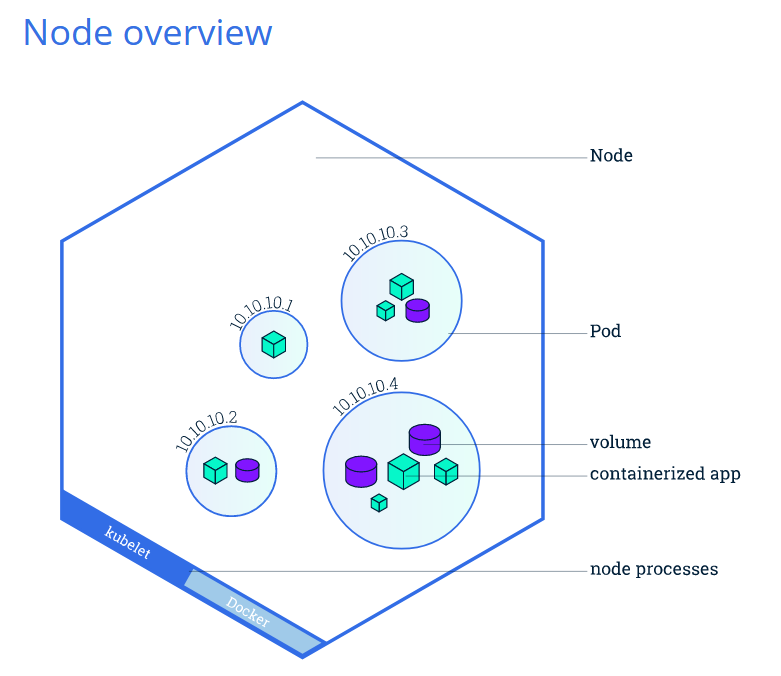
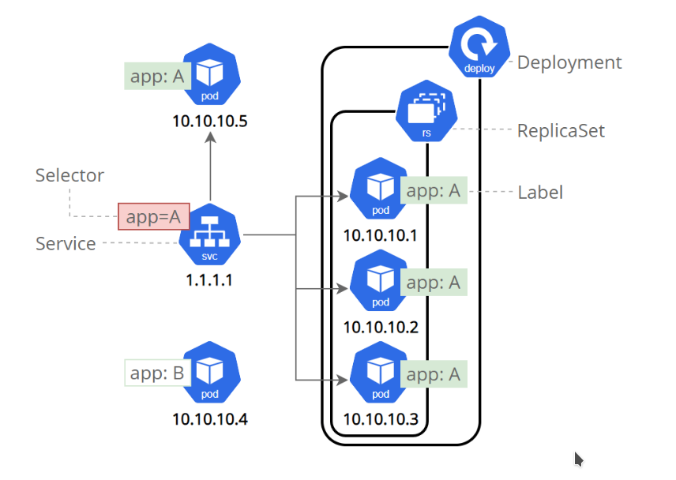
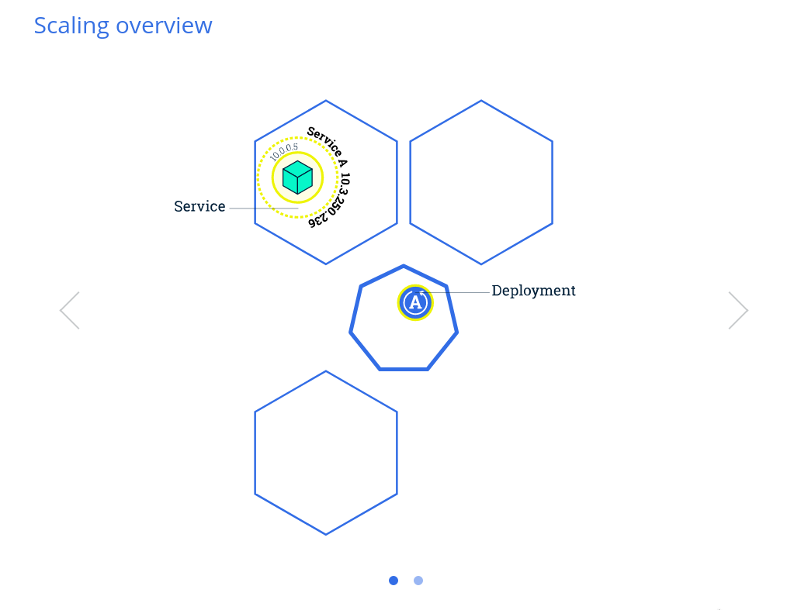
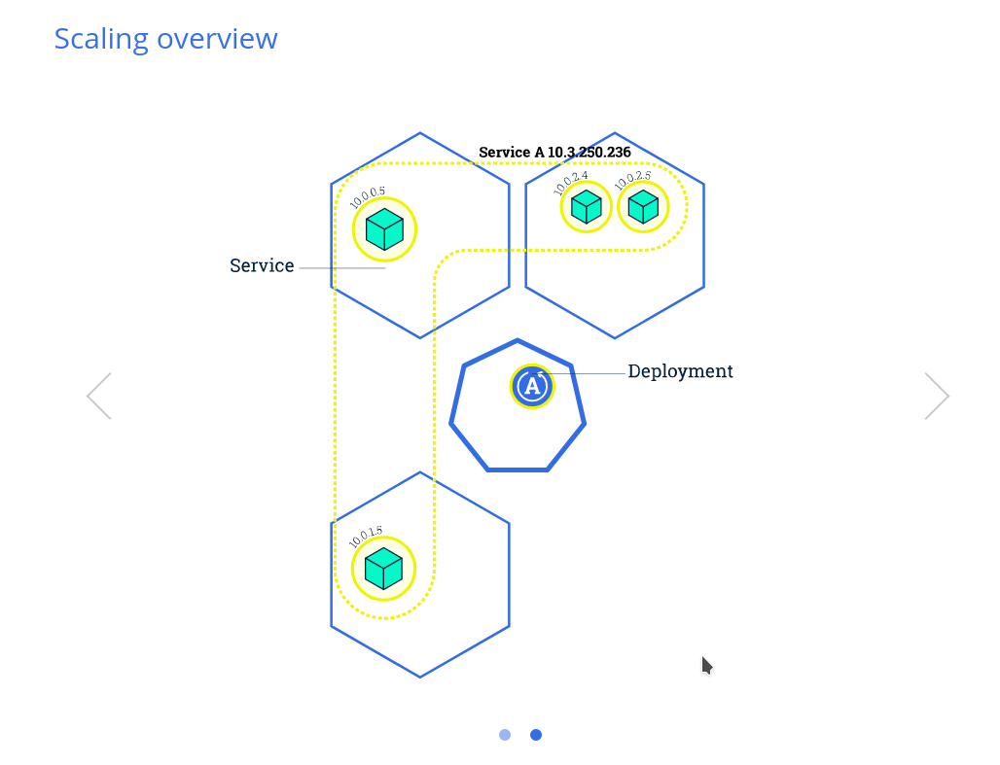

**Warning: ce qui est écrit en italique est ma propre interprétation, ce n'est peut-être pas toujours exact.**
# Introduction à Kubernetes
## 1. Concepts
### 1.1 Applications monolithiques et microservices
### 1.2 Les conteneurs
### 1.3 Orchestration des conteneurs
##  2   Architecture
### 2.1 Architecture de Kubernetes

### 2.2 Les différents types d'installation du cluster
##  3   Utilisation
### 3.1 Création d'un cluster local avec minikube
## 3.2 Les blocs de base de K8s (nodes, pods, label, services, volumes, namespaces, ...)
#### 3.3 Gestion du cluster Kubernetes
#### 3.3.1 L'environnement minikube


# Introduction à Kubernetes

Kubernetes (abrégé K8s) est un mot grec qui veut dire "gouvernail". *On peut faire l'analogie avec le conteneur de marchandise qui a révolutionné la logistique en créant un standard: on peut dire que Docker a également établi un standard dans le packaging d'application, et Kubernetes quand à lui pourrait être comparé à un port automatisé (par exemple via la 5G en Chine https://www.youtube.com/watch?v=GhIdUWpTKvE).*

*Kubernetes permet de faire du [calcul distribué](https://fr.wikipedia.org/wiki/Calcul_distribu%C3%A9) sur un [cluster](https://fr.wikipedia.org/wiki/Grappe_de_serveurs). C'est une sorte de linux réparti sur plusieurs serveurs, dans lequel les conteneurs jouent le rôle de processus: tout comme l'OS gère la répartition des ressources entre les différents processus pour éxecuter des application en parallèle, Kubernetes gère la répartition des ressources entre les conteneurs. En plus de cela, des sondes sont intégrées dans k8s pour surveiller en permanence l'état de santé des conteneurs: si ces derniers disfonctionnent, ils sont tout simplement détruits et recrées pour aboutir à l'état souhaité par l'administrateur, état qu'il a défini dans des fichiers de configuration. Le rôle de l'administrateur kubernetes est différent de celui d'administrateur de vm, qui doit lui gérer lui-même l'état de santé des vm, le stockage et l'infrastructure réseau.*

## 1. Concepts
### 1.1 Applications monolithiques et microservices
On peut faire le parallèle entre la programmation orientée objet et les microservices: les deux concepts sont basés sur la **modularité** et le minimum de couplage entre les parties d'une application. Un système basé sur un mainframe "legacy" (typiquement dans le secteur bancaire) développé dans des langages plus anciens(tels que Cobol) est un exemple d'application monolithique. Les applications modernes développées pour le cloud (typiquement les GAFAM, Netflix, Uber, toutes les grosses entreprises qui ont besoin de haute disponibilité et de résilience) sont des microservices. Pour simplifier, on pourrait prendre l'image d'un immense rocher versus des petits galets: avec le temps, les nouvelles fonctionnalités et améliorations ont ajouté de la compléxité au code du monolithe, rendant le développement plus difficile et augmentant les durées des mises à jour, alors qu'il est beaucoup plus facile de collecter des cailloux dans un sceau et de les transporter là où c'est nécessaire. Cependant, l'architecture distribuée des microservices est plus complexe.

* modularité

* fléxibilité

### 1.2 Les conteneurs
Un point de départ usuel pour expliquer les conteneurs est de les comparer aux machines virtuelles.
Il y a différentes techniques de virtualisation mais qui peuvent être complémentaires: typiquement faire tourner des conteneurs dans un parc de machines virtuelles.


* Isolateurs(conteneurs)

Avantages des conteneurs:

une très forte densité: on peut déployer beaucoup plus de conteneurs que de machines virtuelles. Par exemple j'ai pû déployer 200 réplications d'un conteneur docker basé sur une image nginx, en 10 secondes, pourtant sur un laptop peu puissant (core i3 dualcore et 6 Go de RAM).

performances: très peu d'overhead (temps passé par le système à ne rien faire d'autre que de se gérer lui-même).
empreinte réduite:  un conteneur est vraiment comme une *enveloppe* autour de l'application. Par exemple une application de test hello-world de taille 1,8Mio peut être packagée dans un conteneur de taille 1,9Mio!

Outre la densité et les performances pendant l'utilisation, on améliore le temps de *cold start*, et, plus important encore on réduit la surface d'attaque au strict minimum (il y a moins de vulénrabilités potentielles dans un binaire que dans un Linux, même un Linux minimaliste).

Cependant, on ne peut pas vraiment parler de virtualisation de système d'exploitation.

**Exemples**: chroot, BSD Jail, OpenVZ, Docker (qui s'appuie sur LXC - Linux Container - et les namespaces, fonctionnalités du noyau Linux)
La principale différence entre un conteneur et une machine virtuelle est que le conteneur **utilise le noyau de l'hôte**, ils sont donc très légers et très faciles  et rapides à déployer/détruire/redéployer.

* Les hyperviseurs de type 2


Utile pour les développeurs et les testeurs, en formation ou pour découvrir de nouveaux OS. Cette solution isole bien les OS invités mais les performances sont bien moindres que dans le cas des hyperviseurs de type 1, car dans le type 2, l'hyperviseur est un programme lourd qui tourne sur l'OS de l'hôte.

**Exemples**: VMware Fusion/Workstation, VirtualBox, QEMU, ...

* Les hyperviseurs de type 1

C'est la solution adoptée en entreprise. L'hyperviseur de type 1 est un noyau système (Linux) très léger (juste avec une busybox) et optimisé pour gérer les accès des noyaux d'OS invités à l'architecture sous-jacente.
Inconvénient: plus onéreux.

**Exemples**: VMware ESXi/vSphere, Hyper-V, KVM, Xen, ...


### 1.3 Orchestration des conteneurs
La gestion d'un petit nombre de conteneurs (pour les développeurs et les testeurs) n'a pas besoin d'un orchestrateur, mais dès qu'on passe dans des environnements de production il faut une Infrastructure As A Service comme K8s, ou Plateform As A Service (OpenShift, Rancher, ...).

* Docker swarm:
La solution d'orchestration de conteneurs de la société Docker est efficace et simple à mettre en place, mais elle a ses limites. Si un conteneur tombe en panne par exemple, c'est l'administrateur qui doit s'occuper manuellement de corriger le problème, et pendant ce temps, l'application est indisponible. Par contre Kubernetes garantit la disponibilité en s'occupant lui-même de corriger ce problème. Ce n'est qu'un exemple de ce que K8s fait de mieux que ses concurrents (Docker Swarm, Mesos,...), on pourrait citer aussi la gestion de l'infrastructure réseau.

* Kubernetes:
À l'origine, Kubernetes vient du projet Borg développé par Google depuis 2005, qu'ils ont ensuite rendu opensource en 2015 sous le nom de Kubernetes, et qui est depuis développpé par de nombrexu acteurs de l'opensource (RedHat, VMWare, ...). K8s est écrit en langage Go, langage développé par Ken Thompson le créateur d'Unix. *Go est un langage efficace pour la programmation parallèle, et donc bien adapté à un projet tel que K8s.* 

********************************************************************************
Qu'est ce qu'un conteneur?
********************************************************************************
Avant de plonger dans l'orchestration de conteneurs, examinons d'abord ce que sont les conteneurs.

Les conteneurs sont une méthode centrée sur les applications pour fournir des applications hautement performantes et évolutives sur toute infrastructure de votre choix. Les conteneurs sont les mieux adaptés pour fournir des microservices en fournissant des environnements virtuels portables et isolés pour que les applications s'exécutent sans interférence d'autres applications en cours d'exécution.

Les microservices sont des applications légères écrites dans divers langages de programmation modernes, avec des dépendances, des bibliothèques et des exigences environnementales spécifiques. Pour garantir qu'une application dispose de tout ce dont elle a besoin pour s'exécuter correctement, elle est empaquetée avec ses dépendances.

Les conteneurs encapsulent les microservices et leurs dépendances mais ne les exécutent pas directement. Les conteneurs exécutent des images de conteneur.

Une image de conteneur regroupe l'application avec son environnement d'exécution, ses bibliothèques et ses dépendances, et elle représente la source d'un conteneur déployé pour offrir un environnement exécutable isolé pour l'application. Les conteneurs peuvent être déployés à partir d'une image spécifique sur de nombreuses plates-formes, telles que les postes de travail, les machines virtuelles, le cloud public, etc.


********************************************************************************
L'orchestration des conteneurs:
********************************************************************************

Avec les entreprises qui conteneurisent leurs applications et les déplacent vers le cloud, il existe une demande croissante de solutions d'orchestration de conteneurs. Bien qu'il existe de nombreuses solutions disponibles, certaines sont de simples redistributions d'outils d'orchestration de conteneurs bien établis, enrichis de fonctionnalités et, parfois, de certaines limitations de flexibilité.

Bien que non exhaustive, la liste ci-dessous fournit quelques outils et services d'orchestration de conteneurs disponibles aujourd'hui:

Amazon Elastic Container Service
Amazon Elastic Container Service (ECS) est un service hébergé fourni par Amazon Web Services (AWS) pour exécuter des conteneurs Docker à grande échelle sur son infrastructure.
Instances de conteneur Azure
Azure Container Instance (ACI) est un service d'orchestration de conteneur de base fourni par Microsoft Azure.
Azure Service Fabric
Azure Service Fabric est un orchestrateur de conteneurs open source fourni par Microsoft Azure.
Kubernetes
Kubernetes est un outil d'orchestration open source, initialement lancé par Google, qui fait aujourd'hui partie du projet Cloud Native Computing Foundation (CNCF).
Marathon
Marathon est un framework pour exécuter des conteneurs à grande échelle sur Apache Mesos.
Nomade
Nomad est l'orchestrateur de conteneurs et de charges de travail fourni par HashiCorp.
Essaim de dockers
Docker Swarm est un orchestrateur de conteneurs fourni par Docker, Inc. Il fait partie de Docker Engine.Avec les entreprises qui conteneurisent leurs applications et les déplacent vers le cloud, il existe une demande croissante de solutions d'orchestration de conteneurs. Bien qu'il existe de nombreuses solutions disponibles, certaines sont de simples redistributions d'outils d'orchestration de conteneurs bien établis, enrichis de fonctionnalités et, parfois, de certaines limitations de flexibilité.

Bien que non exhaustive, la liste ci-dessous fournit quelques outils et services d'orchestration de conteneurs disponibles aujourd'hui:

Amazon Elastic Container Service
Amazon Elastic Container Service (ECS) est un service hébergé fourni par Amazon Web Services (AWS) pour exécuter des conteneurs Docker à grande échelle sur son infrastructure.
Instances de conteneur Azure
Azure Container Instance (ACI) est un service d'orchestration de conteneur de base fourni par Microsoft Azure.
Azure Service Fabric
Azure Service Fabric est un orchestrateur de conteneurs open source fourni par Microsoft Azure.
Kubernetes
Kubernetes est un outil d'orchestration open source, initialement lancé par Google, qui fait aujourd'hui partie du projet Cloud Native Computing Foundation (CNCF).
Marathon
Marathon est un framework pour exécuter des conteneurs à grande échelle sur Apache Mesos.
Nomade
Nomad est l'orchestrateur de conteneurs et de charges de travail fourni par HashiCorp.
Essaim de dockers
Docker Swarm est un orchestrateur de conteneurs fourni par Docker, Inc. Il fait partie de Docker Engine.


********************************************************************************
Pourquoi utiliser des conteneurs?
********************************************************************************

Bien que nous puissions gérer manuellement quelques conteneurs ou écrire des scripts pour gérer le cycle de vie de dizaines de conteneurs, les orchestrateurs facilitent grandement les choses pour les opérateurs, en particulier lorsqu'il s'agit de gérer des centaines et des milliers de conteneurs s'exécutant sur une infrastructure mondiale.

La plupart des orchestrateurs de conteneurs peuvent:

- Regrouper les hôtes lors de la création d'un cluster
- Planifier les conteneurs à exécuter sur les hôtes du cluster en fonction de la disponibilité des ressources
- Permettre aux conteneurs d'un cluster de communiquer entre eux quel que soit l'hôte sur lequel ils sont déployés dans le cluster
- Lier des conteneurs et des ressources de stockage
- Regroupez des ensembles de conteneurs similaires et liez-les à des constructions d'équilibrage de charge pour simplifier l'accès aux applications conteneurisées en créant un niveau d'abstraction entre les conteneurs et l'utilisateur
- Gérez et optimisez l'utilisation des ressources
Permettre la mise en œuvre de stratégies pour sécuriser l'accès aux applications exécutées à l'intérieur des conteneurs.

Avec toutes ces fonctionnalités configurables mais flexibles, les orchestrateurs de conteneurs sont un choix évident lorsqu'il s'agit de gérer des applications conteneurisées à grande échelle. Dans ce cours, nous explorerons Kubernetes, l'un des outils d'orchestration de conteneurs les plus demandés actuellement.

### 3.3 Gestion du cluster Kubernetes
#### 3.3.1 L'environnement minikube
********************************************************************************
Créer un cluster kubernetes avec minikube
********************************************************************************

```console
$ minikube start 
* minikube v1.8.1 on Ubuntu 18.04
* Using the none driver based on user configuration
* Running on localhost (CPUs=2, Memory=2460MB, Disk=145651MB) ...
* OS release is Ubuntu 18.04.4 LTS
* Preparing Kubernetes v1.17.3 on Docker 19.03.6 ...
- kubelet.resolv-conf=/run/systemd/resolve/resolv.conf
* Launching Kubernetes ... 
* Enabling addons: default-storageclass, storage-provisioner
* Configuring local host environment ...
* Waiting for cluster to come online ...
* Done! kubectl is now configured to use "minikube"
$ 
```


```console
$ kubectl cluster-info 
Kubernetes master is running at https://172.17.0.28:8443
KubeDNS is running at https://172.17.0.28:8443/api/v1/namespaces/kube-system/services/kube-dns:dns/proxy

To further debug and diagnose cluster problems, use 'kubectl cluster-info dump'.
$ kubectl get nodes 
NAME       STATUS   ROLES    AGE    VERSION
minikube   Ready    master   102s   v1.17.3
$ 
```

********************************************************************************
deployer une application
********************************************************************************

```console
$ kubectl version 
Client Version: version.Info{Major:"1", Minor:"17", GitVersion:"v1.17.0", GitCommit:"70132b0f130acc0bed193d9ba59dd186f0e634cf", GitTreeState:"clean", BuildDate:"2019-12-07T21:20:10Z", GoVersion:"go1.13.4", Compiler:"gc", Platform:"linux/amd64"}
Server Version: version.Info{Major:"1", Minor:"17", GitVersion:"v1.17.0", GitCommit:"70132b0f130acc0bed193d9ba59dd186f0e634cf", GitTreeState:"clean", BuildDate:"2019-12-07T21:12:17Z", GoVersion:"go1.13.4", Compiler:"gc", Platform:"linux/amd64"}
$ kubectl get nodes 
NAME       STATUS   ROLES    AGE   VERSION
minikube   Ready    master   31s   v1.17.0
$ kubectl create deployment kubernetes-bootcamp --image=gcr.io/google-samples/kubernetes-bootcamp:v1
deployment.apps/kubernetes-bootcamp created
$ kubectl get deployments.apps 
NAME                  READY   UP-TO-DATE   AVAILABLE   AGE
kubernetes-bootcamp   1/1     1            1           38s
$ 
```
ON va exécuter la commande ```kubectl proxy``` dans un autre terminal et laisser la commande tourner.
```console
$ echo -e "\n\n\n\e[92mStarting Proxy. After starting it will not output a response. Please click the first Terminal Tab\n"; 
kubectl proxy

Starting Proxy. After starting it will not output a response. Please click the first Terminal Tab
```
```console
$ kubectl proxy
Starting to serve on 127.0.0.1:8001
```

Nous avons maintenant une connexion entre notre hôte (le terminal en ligne) et le cluster Kubernetes. Le proxy permet un accès direct à l'API depuis ces terminaux.

On peut voir toutes ces API hébergées via le point de terminaison du proxy. Par exemple, nous pouvons interroger la version directement via l'API à l'aide de la commande curl (commande à éxecuter sur le premier terminal):

```console
$ curl http://localhost:8001/version
{
"major": "1",
"minor": "17",
"gitVersion": "v1.17.0",
"gitCommit": "70132b0f130acc0bed193d9ba59dd186f0e634cf",
"gitTreeState": "clean",
"buildDate": "2019-12-07T21:12:17Z",
"goVersion": "go1.13.4",
"compiler": "gc",
"platform": "linux/amd64"
}$ 
```

Les pods qui s'exécutent dans Kubernetes s'exécutent sur un réseau privé et isolé. Par défaut, ils sont visibles depuis d'autres pods et services au sein du même cluster Kubernetes, mais pas en dehors de ce réseau. Lorsque nous utilisons kubectl, nous interagissons via un point de terminaison d'API pour communiquer avec notre application.

```console
$ export POD_NAME=$(kubectl get pods -o go-template --template '{{range .items}}{{.metadata.name}}{{"\n"}}{{end}}')

$ echo Name of the Pod: $POD_NAME
Name of the Pod: kubernetes-bootcamp-69fbc6f4cf-8nmw9
$ 
```

********************************************************************************
Kubernetes Pods
********************************************************************************

Lorsqu-on a créé un déploiement dans le module 2, Kubernetes a créé un pod pour héberger votre instance d'application. Un pod est une abstraction Kubernetes qui représente un groupe d'un ou plusieurs conteneurs d'application (tels que Docker) et certaines ressources partagées pour ces conteneurs. Ces ressources comprennent:

Stockage partagé, sous forme de volumes
Mise en réseau, en tant qu'adresse IP de cluster unique
Informations sur la façon d'exécuter chaque conteneur, telles que la version de l'image du conteneur ou des ports spécifiques à utiliser

Un pod modélise un «hôte logique» spécifique à une application et peut contenir différents conteneurs d'application qui sont relativement étroitement couplés. Par exemple, un pod peut inclure à la fois le conteneur avec votre application Node.js et un autre conteneur qui alimente les données à publier par le serveur Web Node.js. Les conteneurs d'un pod partagent une adresse IP et un espace de port, sont toujours colocalisés et co-programmés, et s'exécutent dans un contexte partagé sur le même noeud.

Les pods sont l'unité atomique sur la plate-forme Kubernetes. Lorsque nous créons un déploiement sur Kubernetes, ce déploiement crée des pods avec des conteneurs à l'intérieur (par opposition à la création directe de conteneurs). Chaque pod est lié au noeud où il est planifié et y reste jusqu'à la fin (conformément à la politique de redémarrage) ou la suppression. En cas de défaillance d'un noeud, des pods identiques sont planifiés sur d'autres noeuds disponibles dans le cluster.
Résumé:


Un pod est un groupe d'un ou plusieurs conteneurs d'applications (tels que Docker) et comprend un stockage partagé (volumes), une adresse IP et des informations sur la façon de les exécuter.




********************************************************************************
Noeuds
********************************************************************************


Un pod fonctionne toujours sur un noeud. Un noeud est une machine de travail dans Kubernetes et peut être une machine virtuelle ou physique, selon le cluster. Chaque noeud est géré par le maître. Un noeud peut avoir plusieurs pods et le maître Kubernetes gère automatiquement la planification des pods sur les noeuds du cluster. La planification automatique du Master prend en compte les ressources disponibles sur chaque Noeud.

Chaque noeud Kubernetes exécute au moins:

Kubelet, un processus responsable de la communication entre le maître Kubernetes et le noeud; il gère les pods et les conteneurs fonctionnant sur une machine.
Un environnement d'exécution de conteneur (comme Docker) chargé d'extraire l'image de conteneur d'un registre, de décompresser le conteneur et d'exécuter l'application.

*Les conteneurs ne doivent être planifiés ensemble dans un seul pod que s'ils sont étroitement couplés et doivent partager des ressources telles qu'un disque.*





*****************************************************************************************
### Explorer une application
*****************************************************************************************

Les opérations les plus courantes peuvent être effectuées avec les commandes kubectl suivantes:

kubectl get - liste des ressources
kubectl describe - affiche des informations détaillées sur une ressource
kubectl logs - imprimer les journaux d'un conteneur dans un pod
kubectl exec - exécute une commande sur un conteneur dans un pod

**Exemples**

```console
ulysse@debian101:~$ kubectl describe pods                                                                                                                                   Name:         kubernetes-bootcamp-57978f5f5d-592wt                                                                                                                          Namespace:    default                                                                                                                                                       Priority:     0                                                                                                                                                             Node:         minikube/192.168.49.2                                                                                                                                         Start Time:   Mon, 15 Feb 2021 13:16:28 +0100                                                                                                                               Labels:       app=kubernetes-bootcamp                                                                                                                                                     pod-template-hash=57978f5f5d                                                                                                                                  Annotations:  <none>                                                                                                                                                        Status:       Running                                                                                                                                                       IP:           172.17.0.3                                                                                                                                                    IPs:                                                                                                                                                                          IP:           172.17.0.3                                                                                                                                                  Controlled By:  ReplicaSet/kubernetes-bootcamp-57978f5f5d                                                                                                                   Containers:                                                                                                                                                                   kubernetes-bootcamp:                                                                                                                                                          Container ID:   docker://1908c61ca2747d61d9e33cc9c1c97054e550b95dbfaeca390cc43924b934a26b                                                                                   Image:          gcr.io/google-samples/kubernetes-bootcamp:v1                                                                                                                Image ID:       docker-pullable://gcr.io/google-samples/kubernetes-bootcamp@sha256:0d6b8ee63bb57c5f5b6156f446b3bc3b3c143d233037f3a2f00e279c8fcc64af                         Port:           <none>                                                                                                                                                      Host Port:      <none>                                                                                                                                                      State:          Running                                                                                                                                                       Started:      Mon, 15 Feb 2021 13:17:15 +0100                                                                                                                             Ready:          True                                                                                                                                                        Restart Count:  0                                                                                                                                                           Environment:    <none>                                                                                                                                                      Mounts:                                                                                                                                                                       /var/run/secrets/kubernetes.io/serviceaccount from default-token-ds46q (ro)                                                                                           Conditions:                                                                                                                                                                   Type              Status                                                                                                                                                    Initialized       True                                                                                                                                                      Ready             True                                                                                                                                                      ContainersReady   True                                                                                                                                                      PodScheduled      True                                                                                                                                                    Volumes:                                                                                                                                                                      default-token-ds46q:                                                                                                                                                          Type:        Secret (a volume populated by a Secret)                                                                                                                        SecretName:  default-token-ds46q                                                                                                                                            Optional:    false                                                                                                                                                      QoS Class:       BestEffort                                                                                                                                                 Node-Selectors:  <none>                                                                                                                                                     Tolerations:     node.kubernetes.io/not-ready:NoExecute op=Exists for 300s                                                                                                                   node.kubernetes.io/unreachable:NoExecute op=Exists for 300s                                                                                                Events:                                                                                                                                                                       Type    Reason     Age   From               Message                                                                                                                         ----    ------     ----  ----               -------                                                                                                                         Normal  Scheduled  67m   default-scheduler  Successfully assigned default/kubernetes-bootcamp-57978f5f5d-592wt to minikube                                                  Normal  Pulling    67m   kubelet            Pulling image "gcr.io/google-samples/kubernetes-bootcamp:v1"                                                                    Normal  Pulled     66m   kubelet            Successfully pulled image "gcr.io/google-samples/kubernetes-bootcamp:v1" in 43.971962506s                                       Normal  Created    66m   kubelet            Created container kubernetes-bootcamp                                                                                           Normal  Started    66m   kubelet            Started container kubernetes-bootcamp
```


Vous pouvez utiliser ces commandes pour voir quand les applications ont été déployées, quel est leur état actuel, où elles s'exécutent et quelles sont leurs configurations.

Maintenant que nous en savons plus sur nos composants de cluster et la ligne de commande, explorons notre application.

*Un noeud est une machine de travail dans Kubernetes et peut être une VM ou une machine physique, selon le cluster. Plusieurs pods peuvent s'exécuter sur un seul noeud*.


```console
$ kubectl describe pods
Name:         kubernetes-bootcamp-765bf4c7b4-qnsrl
Namespace:    default
Priority:     0
Node:         minikube/172.17.0.15
Start Time:   Mon, 15 Feb 2021 14:19:05 +0000
Labels:       pod-template-hash=765bf4c7b4
run=kubernetes-bootcamp
Annotations:  <none>
Status:       Running
IP:           172.18.0.4
IPs:
IP:           172.18.0.4
Controlled By:  ReplicaSet/kubernetes-bootcamp-765bf4c7b4
Containers:
kubernetes-bootcamp:
Container ID:   docker://c9f8d949af256cf489917a1019a6b551b165a0437cfa3d1949ce32d83579037c
Image:          gcr.io/google-samples/kubernetes-bootcamp:v1
Image ID:       docker-pullable://jocatalin/kubernetes-bootcamp@sha256:0d6b8ee63bb57c5f5b6156f446b3bc3b3c143d233037f3a2f00e279c8fcc64af
Port:           8080/TCP
Host Port:      0/TCP
State:          Running
Started:      Mon, 15 Feb 2021 14:19:08 +0000
Ready:          True
Restart Count:  0
Environment:    <none>
Mounts:
/var/run/secrets/kubernetes.io/serviceaccount from default-token-xm9zk (ro)
Conditions:
Type              Status
Initialized       True
Ready             True
ContainersReady   True
PodScheduled      True
Volumes:
default-token-xm9zk:
Type:        Secret (a volume populated by a Secret)
SecretName:  default-token-xm9zk
Optional:    false
QoS Class:       BestEffort
Node-Selectors:  <none>
Tolerations:     node.kubernetes.io/not-ready:NoExecute for 300s
node.kubernetes.io/unreachable:NoExecute for 300s
Events:
Type     Reason            Age                From               Message
----     ------            ----               ----               -------
Warning  FailedScheduling  14s (x3 over 22s)  default-scheduler  0/1 nodes are available: 1 node(s) had taints that the pod didn't tolerate.
Normal   Scheduled         8s                 default-scheduler  Successfully assigned default/kubernetes-bootcamp-765bf4c7b4-qnsrl to minikube
Normal   Pulled            5s                 kubelet, minikube  Container image "gcr.io/google-samples/kubernetes-bootcamp:v1" already present on machine
Normal   Created           5s                 kubelet, minikube  Created container kubernetes-bootcamp
Normal   Started           4s                 kubelet, minikube  Started container kubernetes-bootcamp
$
```


Rappelez-vous que les pods fonctionnent dans un réseau privé isolé - nous devons donc leur accéder par proxy afin de pouvoir les déboguer et interagir avec eux. Pour ce faire, nous utiliserons la commande proxy kubectl pour exécuter un proxy dans une deuxième fenêtre de terminal. Cliquez sur la commande ci-dessous pour ouvrir automatiquement un nouveau terminal et exécuter le proxy:

```console
$ echo -e "\n\n\n\e[92mStarting Proxy. After starting it will not output e first Terminal Tab\n"; kubectl proxy


Starting Proxy. After starting it will not output a response. Please click the first Terminal Tab

Starting to serve on 127.0.0.1:8001
```


Encore une fois, nous allons obtenir le nom du pod et interroger ce pod directement via le proxy. Pour obtenir le nom du pod et le stocker dans la variable d'environnement POD_NAME:

```console
$ echo -e "\n\n\n\e[92mStarting Proxy. After starting it will not output a response. Please click the first Terminal Tab\n";
$ kubectl proxy
``

Now again, we'll get the Pod name and query that pod directly through the proxy. To get the Pod name and store it in the POD_NAME environment variable:

```console
$ export POD_NAME=$(kubectl get pods -o go-template --template '{{range .items}}{{.metadata.name}}{{"\n"}}{{end}}')
$ echo Name of the Pod: $POD_NAME
```

- Container logs

Tout ce que l'application enverrait normalement à STDOUT devient des journaux pour le conteneur dans le pod. Nous pouvons récupérer ces journaux à l'aide de la commande kubectl logs:

```console
$ kubectl logs kubernetes-bootcamp-765bf4c7b4-qnsrl
Kubernetes Bootcamp App Started At: 2021-02-15T14:19:08.285Z | Running On:  kubernetes-bootcamp-765bf4c7b4-qnsrl

Running On: kubernetes-bootcamp-765bf4c7b4-qnsrl | Total Requests: 1 | App Uptime: 1785.875 seconds | Log Time: 2021-02-15T14:48:54.160Z
$
```

- éxécuter une ommande dans un conteneur

Nous pouvons exécuter des commandes directement sur le conteneur une fois que le Pod est opérationnel. Pour cela, nous utilisons la commande exec et utilisons le nom du Pod comme paramètre. 

Usage:                                                                                                                                                                        kubectl exec (POD | TYPE/NAME) [-c CONTAINER] [flags] -- COMMAND [args...] [options] 

Listons par exemple les variables d'environnement:

```console
$ kubectl exec $POD_NAME -- env
PATH=/usr/local/sbin:/usr/local/bin:/usr/sbin:/usr/bin:/sbin:/bin
HOSTNAME=kubernetes-bootcamp-765bf4c7b4-qnsrl
KUBERNETES_PORT_443_TCP=tcp://10.96.0.1:443
KUBERNETES_PORT_443_TCP_PROTO=tcp
KUBERNETES_PORT_443_TCP_PORT=443
KUBERNETES_PORT_443_TCP_ADDR=10.96.0.1
KUBERNETES_SERVICE_HOST=10.96.0.1
KUBERNETES_SERVICE_PORT=443
KUBERNETES_SERVICE_PORT_HTTPS=443
KUBERNETES_PORT=tcp://10.96.0.1:443
NPM_CONFIG_LOGLEVEL=info
NODE_VERSION=6.3.1
HOME=/root
$
```
Encore une fois, il convient de mentionner que le nom du conteneur lui-même peut être omis car nous n'avons qu'un seul conteneur dans le pod.

Commençons ensuite une session bash dans le conteneur du pod:


```console
$ kubectl exec -ti $POD_NAME bash
root@kubernetes-bootcamp-765bf4c7b4-qnsrl:/#
```

Nous avons maintenant une console ouverte sur le conteneur où nous exécutons notre application NodeJS. Le code source de l'application se trouve dans le fichier server.js:

```console
root@kubernetes-bootcamp-765bf4c7b4-qnsrl:/# cat server.js
var http = require('http');
var requests=0;
var podname= process.env.HOSTNAME;
var startTime;
var host;
var handleRequest = function(request, response) {
response.setHeader('Content-Type', 'text/plain');
response.writeHead(200);
response.write("Hello Kubernetes bootcamp! | Running on: ");
response.write(host);
response.end(" | v=1\n");
console.log("Running On:" ,host, "| Total Requests:", ++requests,"| App Uptime:", (new Date() - startTime)/1000 , "seconds", "| Log Time:",new Date());
}
var www = http.createServer(handleRequest);
www.listen(8080,function () {
startTime = new Date();;
host = process.env.HOSTNAME;
console.log ("Kubernetes Bootcamp App Started At:",startTime, "| Running On: " ,host, "\n" );
});
$ 

```

```console
root@kubernetes-bootcamp-765bf4c7b4-qnsrl:/# curl localhost:8080
Hello Kubernetes bootcamp! | Running on: kubernetes-bootcamp-765bf4c7b4-qnsrl | v=1
```

********************************************************************************
Utiliser les services pour exposer son application
********************************************************************************





********************************************************************************
Mettre à l'échelle une application
********************************************************************************



********************************************************************************
Mettre à jour une application
********************************************************************************
